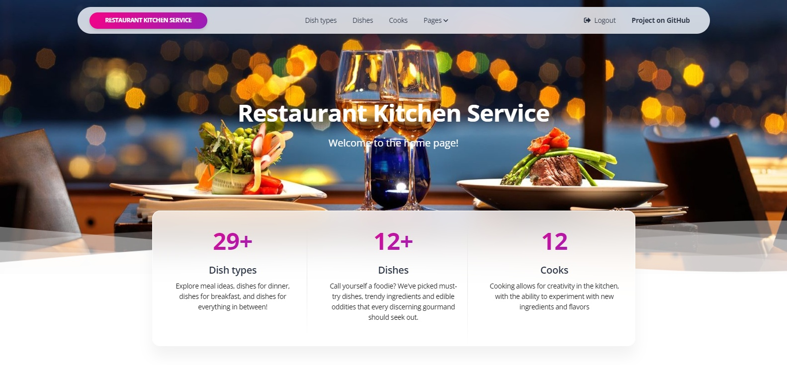
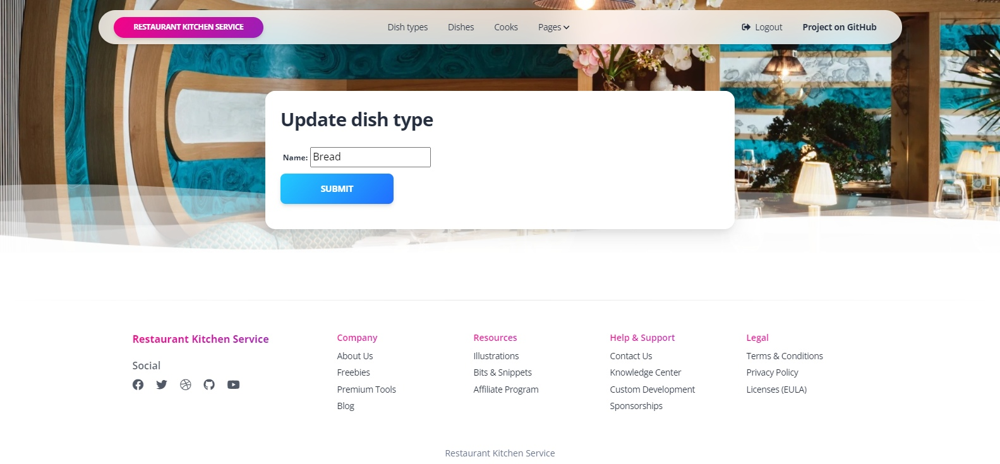
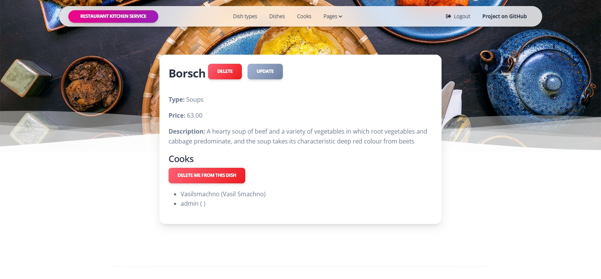
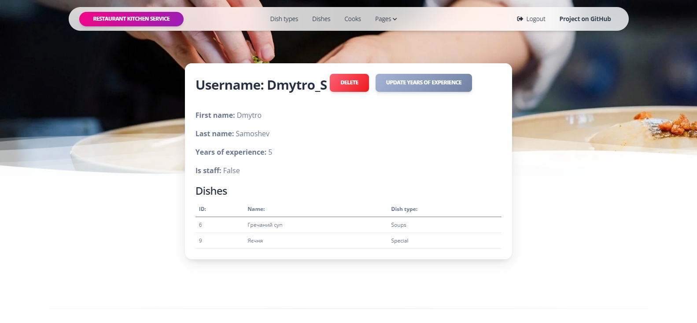

# Restaurant-Kitchen-Service Project

Django project for managing dishes and cooks in Restaurant

## Check it out!

[Restaurant Kitchen Service deployed to Render](https://restaurant-kitchen-service-zqs1.onrender.com/)

For test use login/password: user/user12345

## Installation

Python3 must be already installed

```shell
git clone https://github.com/V-Shkrobatskyi/restaurant-kitchen-service
cd restaurant-kitchen-service
python3 -m venv venv
source venv/bit/activate
pip install -r requirements.txt
python manage.py runserver  # starts Django Server
```

## Features

* Authentication functionality for Cook/User
* Managing dishes, cooks & dish types directly from website interface
* Powerful admin panel for advanced managing

## Demo




